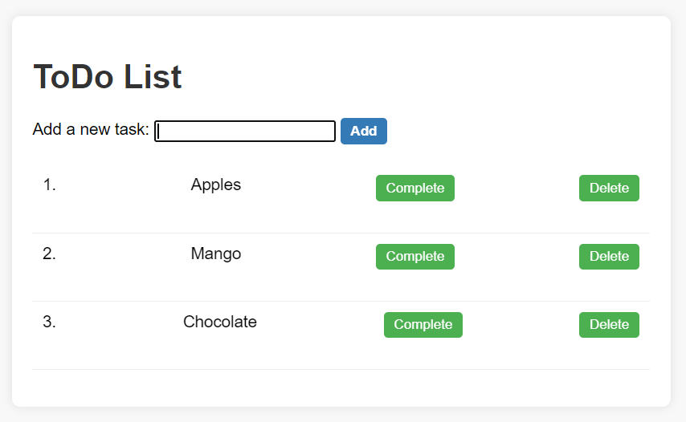

# ToDo List Web Application

A simple ToDo list web application built with Node.js and Express.



## Getting Started

### Prerequisites

- Node.js installed
- npm (Node Package Manager) installed

### Installation

1. Clone the repository:

   ```bash
   git clone <repository-url>
   ```

2. Navigate to the project directory:

   ```bash
   cd my-todo-app
   ```

3. Install dependencies:

   ```bash
   npm install
   ```

4. Start the application:

   ```bash
   node app.js
   ```

   The server will be running at [http://localhost:3000](http://localhost:3000).

## Usage

1. Open your web browser and go to [http://localhost:3000](http://localhost:3000).
2. Add new tasks to the ToDo list.
3. Mark tasks as completed or delete them as needed.

## Contributing

If you'd like to contribute to this project, please follow these steps:

1. Fork the repository.
2. Create a new branch for your feature or bug fix.
3. Make your changes and commit them.
4. Push your changes to your fork.
5. Submit a pull request.

## License

This project is licensed under the [MIT License](LICENSE).
